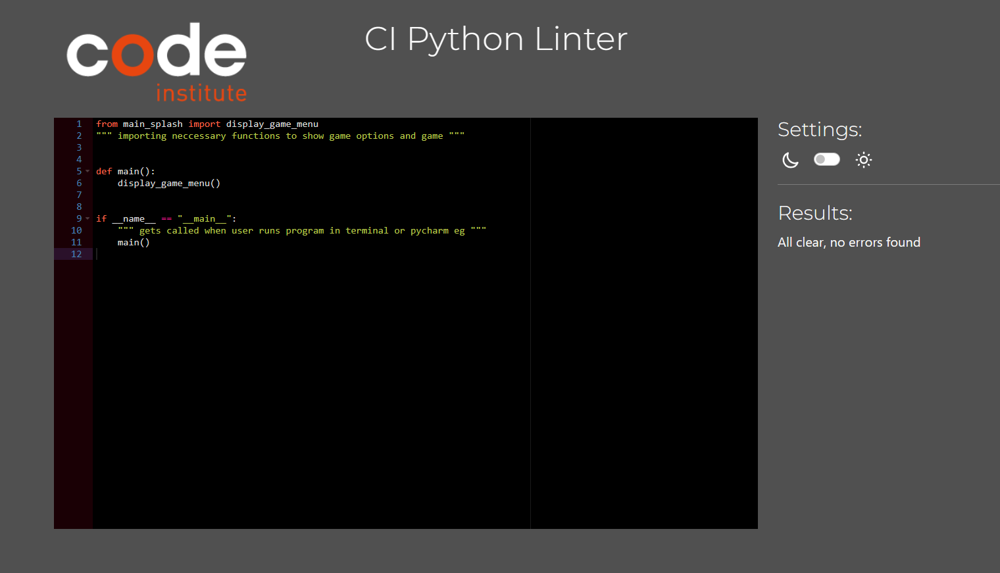
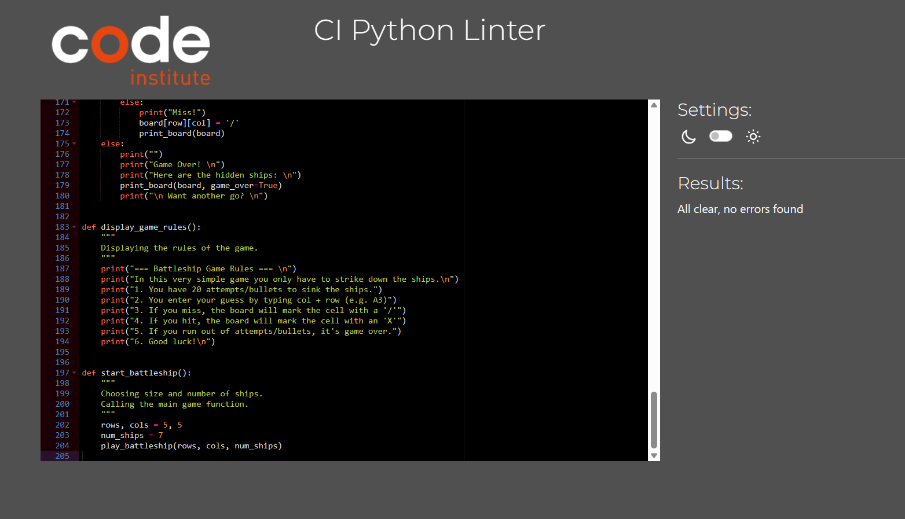

# Battleships Game

This is a classic Battleships game with 1 player only against the computer. I had fun making this game, however, due to the issues with Codeanywhere I partly had to work on this code offline in VS Code.

## How to Play
1. The game board is set up with a grid of 10x10.
2. 4 ships is placed on the board.
3. The player inputs their guess by writing rows + column (e.g. "A6" or "C3")
4. The player has 50 attempts/bullets to strike down the battleships.
5. If the player runs out of attempts the game will close and show "Game over!".
6. If the player wins the game will show "Good job! You won!"

## Features

### The Game
1. Heading at the top displaying the game name.
2. User gets to choose to either play game, read game rules or exit the app.

### Game Rules
1. Displaying a list of rules on how to play the game.
2. The user can then choose another option in the menu.

### Exit
1. If the user chooses "Exit" the entire game shuts down.

### Play Game - Enter guess
User input their guess in the Terminal by printing 'B6' for example.

### Play Game - Hit
If user strikes a battleship, an X will be visible on the board.

### Play Game - Miss
If user strikes a battleship, an X will be visible on the board.

### Play Game - Invalid Guess
If user types in number before letter, typing other symbols, letters or numbers, or trying to go off grid an 'Invalid Guess' statement will appear, asking the user to provide a new input.

### Play Game - Keep Track
Throughout the game, the score will remain until user wins or it's game over.

### Play Game - Game Over
If the user looses, a print statement with "Game Over" will appear along with the board showing the remaining hidden ships. The user will then be asked to try again or choose another option from the menu.

### Play Game - Winner!
If the user wins, a print statement with "Good job, you won!" will appear along with the board showing the score. The user will then be asked to play again or choose another option from the menu.

## Future features

1. Creating a multiplayer version
2. Making the game more interactive by letting the player put their own ships on the board

# Technologies
For this project I have been working with:
1. IDE - VSCode and Codeanywhere.
2. Python - Creating the game.
3. Checking the game throughout the process in the Terminal.
4. Tried to deploy to Heroku.

# Testing

![Testing]

Throughout this project I have been testing the game by running it in the Terminal. 

## Solved Bugs

**1. Grid reference** - The grid was not displaying letters horizontally and numbers vertically. Solved it by adding the grid_reference() function to display letters horizontally and numbers vertically.

**2. Grid reference shift** - All letters were shifted one space to the right. Turns out I had one line of unneccessary code displaying an extra column with 'O' outside the regular grid.

**3. Indentation errors** - Received repeated indentation errors but mainly in the print_board() and play_battleship() functions. Fixed the indentation by ensuring all code lines in the functions were correctly aligned.

**4. Parsing fail** - Numerous parsing failures. Solved by fixing indentation errors and correct arguments.

**5. Board** - The game board was not displaying all of the O's and some letters were missing. Solved this by clearing out some unneccessary code and simplify it.

**6. Clearing screen** - Added a clear_screen() and it was not clearing the screen after each round. Solved it by putting the clear_screen() at appropriate places in the play_battleship() function to clear the screen after each input guess and when the game is over.

**7. Hidden ships** - The board was not updating correctly when the game was over showing all hidden ships not being sunk. Solved this by modifying the play_battleship() function to print the board after the game was over, either due to winning or losing.

**8. Maximum attempts** - The board was clearing after the maximum attempts instead of printing "Game Over." Solved this by modifying the play_battleship() function to print "Game Over" when the maximum attempts were reached, and then we displayed the board with hidden ships.

## Unresolved Bugs

1. No unresolved bugs.

## Validator Testing
Code has been run through the Code Institutes Linter with no errors.

# Deployment
I deployed my project directly to Heroku by doing the following:

1. Created an account at Heroku.com.
2. Since I haven't received a Student Activation Code for GitHub I added billing information myself on Heroku.
3. Clicked on "Create new app" and named it Code-Institute-3.
4. Clicked on Settings and added Backpacks - Python and Node.js.
5. Made sure the backpacks were in the right order.
6. Connected my GitHub profile and found the right Repository.
7. Manually deployed the page and clicked "Eanble automatic deploys" at the same time.

# Credits 
1. Inspired by [Saran Sundars Battleship for Beginners](https://github.com/SaranSundar/PythonCurriculum/blob/main/Battleships/battleships_complete.py).
2. Simplistic code and functionality has been inspired from [Saran Sundars Battleship for beginners](https://www.youtube.com/watch?v=MgJBgnsDcF0).
3. Borrowing code and modified it from [Code Academy](https://www.youtube.com/watch?v=7Ki_2gr0rsE)
4. Using ideas, nesting functions and other types from this s[Dr Codie](https://www.youtube.com/watch?v=Ej7I8BPw7Gk&list=PLpeS0xTwoWAsn3SwQbSsOZ26pqZ-0CG6i) YouTube series.
5. As usual, a massive amount of searching for answers on [Stack Overflow](https://stackoverflow.com) when troubleshooting.

# Acknowledgement
1. Big thanks to my mentor Luke, being awesome as usual.
2. To my Python enthusiastic friend Nicklas who has tried my game and served me a plate full of errors to solve.